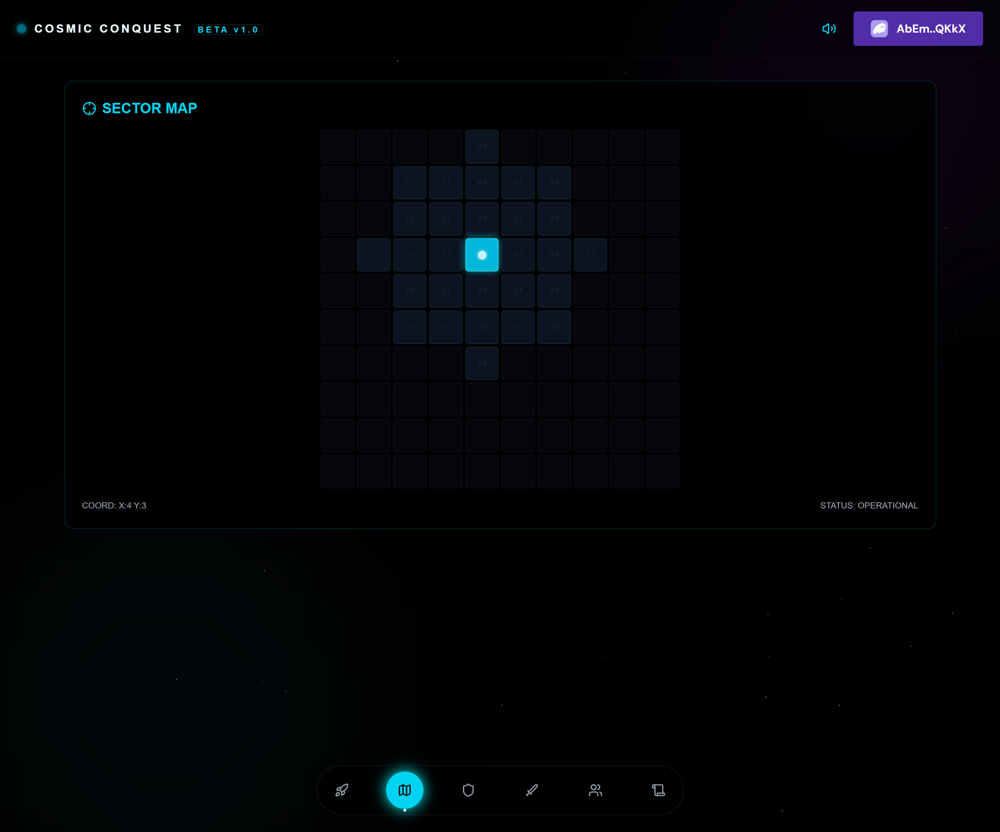
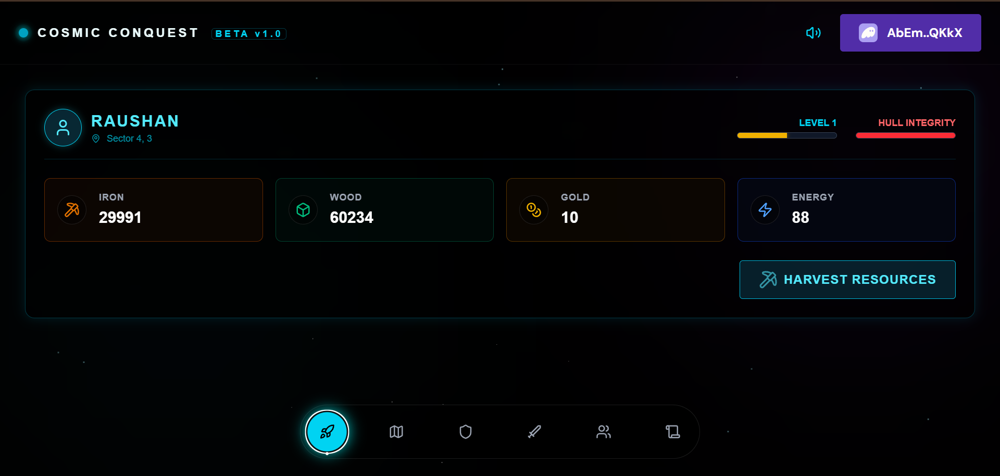

# Cosmic Conquest: Fully On-Chain RTS


**Live Demo:** [https://cosmic-conquest-solana.vercel.app/](https://cosmic-conquest-solana.vercel.app/)


> [!IMPORTANT] > **Demo Availability Notice:** The live demo link provided above is hosted on a devnet environment and may be taken offline or become inaccessible at any time without prior notice.

**Cosmic Conquest** is a decentralized Real-Time Strategy (RTS) game built on the Solana Blockchain using the Anchor Framework and Next.js 16. Unlike hybrid Web3 games, **100% of the logic**, state, assets, and combat mechanics are executed on-chain via the Solana Virtual Machine (SVM). Players engage in resource management, spatial exploration, PvP combat, and alliance formation in a persistent, trustless universe.

---

## Table of Contents

- [Cosmic Conquest: Fully On-Chain RTS](#cosmic-conquest-fully-on-chain-rts)
  - [Introduction](#introduction)
  - [Key Features](#key-features)
- [System Architecture](#system-architecture)
  - [Account Structure & Relationships](#account-structure--relationships)
- [Prerequisites](#prerequisites)
- [Getting Started](#getting-started)
- [Configuration](#configuration)
- [Installation Guide](#installation-guide)
  - [Step 1: Clone the Repository](#step-1-clone-the-repository)
  - [Step 2: Project Structure Overview](#step-2-project-structure-overview)
  - [Step 3: Install Backend Dependencies](#step-3-install-backend-dependencies)
  - [Step 4: Install Frontend Dependencies](#step-4-install-frontend-dependencies)
  - [Step 5: Run the Development Server](#step-5-run-the-development-server)
- [Configuration](#configuration)
  - [1. Get Your Program ID](#51-get-your-program-id)
  - [2. Update the Smart Contract (lib.rs)](#52-update-the-smart-contract-lib-rs)
  - [3. Update Anchor.toml](#53-update-anchortoml)
  - [4. Re-build the Program](#54-re-build-the-program)
  - [5. Deploy the Program](#55-deploy-the-program)
  - [6. Update Frontend Constants](#56-update-frontend-constants)
- [Wallet & Game Setup](#wallet--game-setup)
  - [1. Connect Wallet](#61-connect-wallet)
  - [2. Initialize Player](#62-initialize-player)
- [Visual Walkthrough & Usage](#visual-walkthrough--usage)
  - [Phase 1: Command Dashboard](#phase-1-command-dashboard)
  - [Phase 2: Space Navigation](#phase-2-space-navigation)
  - [Phase 3: Shipyard Refit](#phase-3-shipyard-refit)
  - [Phase 4: PvP Battle Room](#phase-4-pvp-battle-room)
  - [Phase 5: Alliance HQ](#phase-5-alliance-hq)
  - [Phase 6: Quest Ops](#phase-6-quest-ops)
- [Testing](#testing)
- [Troubleshooting](#troubleshooting)
- [Contributing](#contributing)
- [Connect with Me](#connect-with-me)
- [License](#license)

---

## Introduction

Cosmic Conquest leverages the high throughput of Solana to deliver a "Fog of War" exploration experience entirely on-chain. By using Program Derived Addresses (PDAs) for spatial coordinates and resource states, the game ensures that every move, harvest, and attack is a verifiable transaction. This project demonstrates the capability of the **Anchor Framework** to handle complex game state transitions and logic beyond simple token transfers.

> [!NOTE]
> This project is currently deployed on the Solana **Devnet**. All transactions use Devnet SOL and game-specific on-chain resources (Wood, Iron, Gold), which have no real-world monetary value.

---

## Key Features

- **Fully On-Chain Logic**: No centralized game server. Coordinates, resources, and player stats are stored in Solana Accounts.
- **Grid-Based Navigation**: A 10x10 sector grid where movement is restricted by adjacency and energy costs.
- **Dynamic Economy**: Resource generation (Wood, Iron) is calculated based on time deltas (Unix Timestamp) and production rates.
- **PvP Combat Engine**: Deterministic combat outcomes derived from blockhash entropy and player stats (Attack vs Hull).
- **Alliance System**: On-chain organizations with shared treasuries and member management.
- **AAA UI/UX**: Immersive Glassmorphism design, procedural space backgrounds, and specialized sound effects (`use-sound`).

---

## System Architecture

The technical architecture utilizes Solana's Account Model to create a relational database structure on-chain.

### Account Structure & Relationships

We utilize **Program Derived Addresses (PDAs)** to enforce deterministic addressing and secure ownership.

- **Game Global Account (`Game`)**: A singleton account maintaining global settings (Map dimensions, Max players).
  - _Seeds_: `[b"game"]`
- **Player Account (`Player`)**: Stores individual user state (Resources, Coordinates, Upgrades).
  - _Seeds_: `[b"player", game_pubkey, user_pubkey]`
- **Alliance Account (`Alliance`)**: Represents a guild with a shared treasury.
  - _Seeds_: `[b"alliance", alliance_name]`

> [!IMPORTANT]
> The `Player` PDA accounts strictly depend on the `Game` PDA, ensuring that all players are part of the same "Universe" instance.

---

## Prerequisites

Ensure you have the following installed:

- **Node.js**: v20+ recommended ([Download](https://nodejs.org/))
- **Rust & Cargo**: Latest stable version ([Download](https://rustup.rs/))
- **Solana CLI**: v1.18+ ([Guide](https://docs.solanalabs.com/cli/install))
- **Anchor Framework**: Latest version ([Guide](https://www.anchor-lang.com/docs/installation))
- **Yarn**: (`corepack enable` or `npm i -g yarn`)

## Getting Started

### Installation

1. **Clone the Repository**
   ```bash
   git clone https://github.com/raushan728/cosmic-conquest-solana.git
   cd cosmic-conquest-solana
   ```

2. **Install Dependencies**
   ```bash
   yarn install        # Backend dependencies
   cd app && npm install # Frontend dependencies
   ```

3. **Run Development Server**
   ```bash
   cd app
   npm run dev
   ```
   _The game will launch at `http://localhost:3000`._

---

## Configuration

To deploy your own instance of the Cosmic Conquest universe:

1. **Get Program ID**: Run `anchor keys sync` to generate a new keypair.
2. **Update Contract**: Paste the new ID into `program/src/lib.rs` if not auto-updated.
3. **Update Config**: Ensure `[programs.devnet]` in `Anchor.toml` matches your new ID.
4. **Deploy**:
   ```bash
   anchor build
   anchor deploy
   ```
5. **Update Client**: Copy `target/idl/cosmic_conquest.json` to `app/utils/` and update `constants.ts` with the new Program ID.

---


## Wallet & Game Setup

### 6.1. Connect Wallet

Use the **Phantom** or **Solflare** browser extension. Ensure you are connected to **Devnet**.

- _Devnet Faucet:_ Run `solana airdrop 2` in your terminal if you need gas fees.

### 6.2. Initialize Player

On your first login, the game will check for a `Player` PDA. If none exists, you will be prompted to "Establish Neural Link" (Initialize Account). This creates your on-chain avatar.

---

## Visual Walkthrough & Usage

### Phase 1: Command Dashboard

The central hub for managing your empire. View real-time resource generation and initiate harvest transactions.


### Phase 2: Space Navigation

Navigate the 10x10 sector grid. Fog of War hides distant sectors.


### Phase 3: Shipyard Refit

Exchange harvested resources for permanent stat upgrades (Hull, Cannons, Engines).


### Phase 4: PvP Battle Room

Engage in direct wallet-to-wallet combat. Scan for hostile signatures and attack using Public Keys.


### Phase 5: Alliance HQ

Pool resources with other players. Create a shared treasury to dominate the leaderboard.

<!--  (Duplicate of Shipyard image, removed temporarily) -->

### Phase 6: Quest Ops

Daily missions and mystery rewards to boost your progression.
.png>)

---

## Testing

Run the full suite of on-chain integration tests:

```bash
anchor test
```

_This validates the core game mechanics including movement validation, resource math, and combat entropy._

---

## Troubleshooting

> [!WARNING] > **Common Error: "Account does not exist"**
> Ensure you have clicked "Establish Neural Link" to initialize your Player PDA before attempting to move or harvest.

- **Transaction Simulation Failed:** Likely due to insufficient "Energy" or "Resources" for the requested action. Check your dashboard stats.
- **Wallet Connection Error:** Verify you are on **Solana Devnet**. Mainnet is not currently supported.

---

## Contributing

Contributions are welcome!

1.  Fork the Project
2.  Create your Feature Branch (`git checkout -b feature/NewShipClass`)
3.  Commit your Changes (`git commit -m 'Add Frigate Class'`)
4.  Push to the Branch (`git push origin feature/NewShipClass`)
5.  Open a Pull Request

---

## Connect with Me

If you have any questions or want to collaborate, feel free to reach out!

- **Email:** [raushankumarwork74@gmail.com](mailto:raushankumarwork74@gmail.com)
- **LinkedIn:** [Raushan Kumar](https://www.linkedin.com/in/raushan-kumar-807916390/)
- **Telegram:** [@raushan_singh_29](https://t.me/raushan_singh_29)

---

## License

Distributed under the MIT License. See [LICENSE](LICENSE) for more information.
