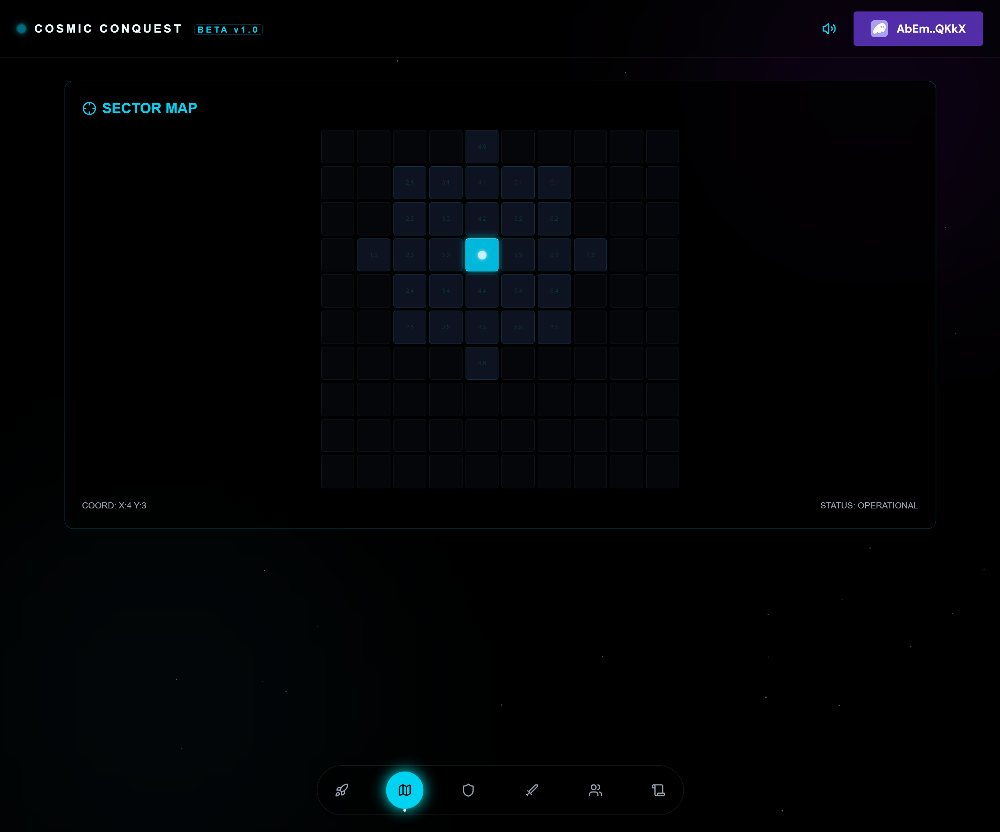
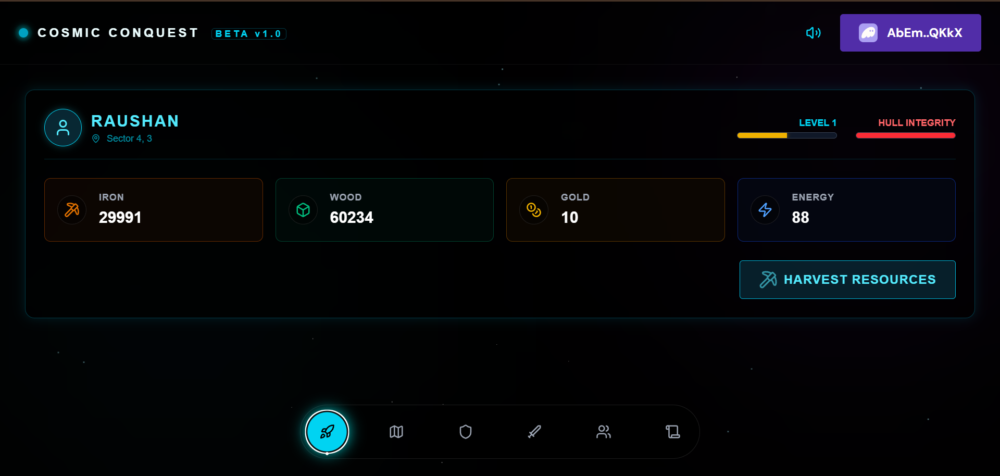

# Cosmic Conquest - Frontend Client

This is the [Next.js] frontend application for Cosmic Conquest, a web-based Real-Time Strategy game built to learn Solana.

[Next.js]: https://nextjs.org/

## Prerequisites

- [Node.js] v20+
- npm

[Node.js]: https://nodejs.org/

## Getting Started

1. Install the dependencies:
   ```bash
   npm install
   ```

2. Run the development server:
   ```bash
   npm run dev
   ```

3. Open [http://localhost:3000](http://localhost:3000) with your browser to play the game.

## Visual Walkthrough

### Phase 1: Command Dashboard
The central hub for managing your empire. View real-time resource generation and initiate harvest transactions.


### Phase 2: Space Navigation
Navigate the 10x10 sector grid. Fog of War hides distant sectors.


### Phase 3: Shipyard Refit
Exchange harvested resources for permanent stat upgrades (Hull, Cannons, Engines).


### Phase 4: PvP Battle Room
Engage in direct wallet-to-wallet combat. Scan for hostile signatures and attack using Public Keys.


### Phase 5: Quest Ops
Daily missions and mystery rewards to boost your progression.
.png)

## Configuration

If you redeploy the Solana program to your own cluster, ensure you update the `PROGRAM_ID` in `utils/constants.ts` to match your new program ID.
